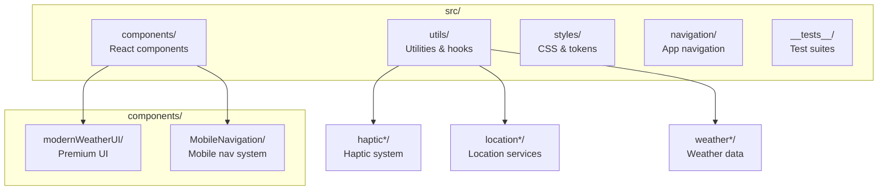

# 🌤️ Premium Weather App

[](https://github.com/and3rn3t/weather/actions/workflows/ci-cd.yml)
[](https://github.com/and3rn3t/weather/actions/workflows/dev-deploy.yml)
[](https://github.com/and3rn3t/weather/actions/workflows/test-only.yml)
[](https://github.com/and3rn3t/weather/actions/workflows/quality.yml)

<sub>Note: SonarCloud analysis runs weekly and on demand; badges are omitted to avoid stale
indicators.</sub>

A cutting-edge React-TypeScript weather application featuring iOS26 UI components, comprehensive
mobile optimization, and production-ready deployment infrastructure.

**🌐 Live Deployment:**

- **Production**: [weather.andernet.dev](https://weather.andernet.dev)
- **Development**: [weather-dev.andernet.dev](https://weather-dev.andernet.dev)

## � Documentation quick links

- [Networking Usage Guide](./docs/guides/NETWORKING_README.md) — shared fetch utilities, hooks,
  caching, headers
- [Production Networking Strategy](./docs/technical/PRODUCTION_NETWORKING_STRATEGY.md) — policies,
  retries, compliance
- [Headers Configuration](./docs/HEADERS_CONFIGURATION.md) — Cloudflare Pages \_headers rules and
  verification
- [Documentation Hub](./docs/README.md) — all guides, reports, and technical docs

## �🚀 Quick Start

```bash
# Clone the repository
git clone https://github.com/and3rn3t/weather.git
cd weather

# Install dependencies
npm install

# Start development server
npm run dev

# Build for production
npm run build:ultra

# Run tests
npm run test:fast

# Health check
npm run health
```

## � **Project Status: COMPLETE**

This weather application has achieved all major development milestones with **iOS26 UI Kit
implementation**, production deployment, comprehensive testing, and professional documentation.

## ✨ **Key Features**

### 🎨 **iOS26 UI Kit (August 2025)**

- **iOS26WeatherInterface** - Advanced weather display with cutting-edge glassmorphism
- **iOS26WeatherCard** - Native iOS-style cards with haptic feedback integration
- **iOS26NavigationBar** - Authentic iOS navigation patterns and accessibility
- **Spring Physics Animations** - Ultra-smooth iOS-style transitions and micro-interactions
- **Advanced Glassmorphism** - Multi-layer depth effects with backdrop blur
- **Haptic Feedback Patterns** - Touch response synchronized with weather interactions

### � **Advanced Search Enhancements** _(NEW - August 2025)_

- **Intelligent Autocorrect** - Levenshtein distance + phonetic matching for typo tolerance
- **Popular Cities Cache** - Instant results for 50 curated world cities with geographic
  prioritization
- **Voice Search Integration** - Web Speech API with 80+ city pronunciation variations
- **Real-time Visual Feedback** - Animated sound waves, confidence indicators, live transcription
- **Full Accessibility** - WCAG 2.1 AA compliant with screen reader announcements

### �📱 **Mobile Excellence**

- **Pull-to-Refresh** - iOS-standard distances (70px trigger, 120px max) with resistance curves
- **Touch Optimization** - Passive events, hardware acceleration, proper touch targets
- **Mobile UX Patterns** - iOS-compliant interaction design and gesture handling
- **Progressive Enhancement** - Graceful degradation with feature detection
- **Battery Optimization** - Efficient animations and minimal background processing

### 🌐 **Production Infrastructure**

- **Cloudflare Pages** - Global CDN hosting with edge computing capabilities
- **GitHub Actions CI/CD** - Automated build, test, and deployment pipeline
- **Custom Domains** - Professional domain configuration with SSL/security
- **Zero Configuration** - No API keys or environment variables required
- **Performance Optimized** - Bundle size: 286.70 kB (gzipped: 89.73 kB)

### ⚡ Performance & Optimization

- **Bundle Optimization** - Production build: 361KB (106KB gzipped)
- **Code Splitting** - Intelligent chunking for optimal loading performance
- **Background Refresh** - Smart weather updates with network and battery awareness
- **Progressive Enhancement** - Graceful degradation for web and mobile platforms

## 🏗️ Architecture

### Tech Stack

- **Frontend**: React 18 + TypeScript + Vite
- **Styling**: CSS-in-JS with modern design tokens
- **State Management**: React Hooks with custom state logic
- **API**: OpenMeteo Weather API
- **Mobile**: Capacitor for native mobile features
- **Testing**: Vitest v3.2.4 + React Testing Library
- **Build**: Vite with optimized production builds

### Project Structure



#### Archive Policy

- `/archive` — for code/assets you want kept locally but excluded from Git and builds (ignored).
- `docs/archive` — for historical documents that should remain versioned and searchable.

## 🎯 Installation & Development

### Prerequisites

- Node.js 18+
- npm or yarn
- Modern browser with ES2020+ support

### Development Setup

```bash
# Install dependencies
npm install

# Start development server (with hot reload)
npm run dev

# Open browser to http://localhost:5173
```

### Production Build

```bash
# Create optimized production build
npm run build

# Preview production build locally
npm run preview

# Analyze bundle size
npm run analyze
```

### Mobile Development

```bash
# Install Capacitor dependencies
npm install @capacitor/core @capacitor/app @capacitor/haptics

# Add mobile platforms
npx cap add android
npx cap add ios

# Build and sync to mobile
npm run build
npx cap sync

# Open in mobile IDE
npx cap open android
npx cap open ios
```

## 🔧 Configuration

### Environment Variables

```bash
# .env/.env.local
VITE_WEATHER_API_URL=https://api.open-meteo.com/v1
VITE_GEOCODING_API_URL=https://nominatim.openstreetmap.org
VITE_APP_NAME=Premium Weather App
VITE_LOG_LEVEL=production # development | production
```

## 📱 Mobile Features

### Haptic Feedback System

The app features an advanced haptic feedback system with:

- **30+ Weather-Specific Patterns**: Unique vibrations for different weather conditions
- **Contextual Intelligence**: Intensity varies by temperature, time of day, and weather severity
- **Progressive Feedback**: Multi-stage haptics for complex interactions
- **Battery Optimization**: Smart triggering with rate limiting and intensity scaling

#### Weather Haptic Patterns

```typescript
// Clear weather - gentle pulse
clear: [15, 60, 15];

// Rain - rhythmic droplet simulation
rainy: [30, 20, 30, 20, 30];

// Thunderstorm - powerful strike pattern
thunderstorm: [80, 40, 60];

// Wind - gusting wind simulation
windy: [20, 40, 30, 60, 40];
```

### Location Services

- **Automatic Detection**: GPS-based location with fallback to IP geolocation
- **Smart Caching**: Intelligent storage with automatic cleanup
- **Background Updates**: Periodic location refresh with battery awareness
- **Network Optimization**: Adaptive behavior based on connection quality

### Swipe Navigation

- **Bi-directional Swiping**: Navigate between Home and Weather screens
- **Visual Feedback**: Progress indicators and smooth animations
- **Haptic Integration**: Touch feedback during swipe interactions
- **Gesture Recognition**: Velocity-based swipe detection with thresholds

## 🎨 Design System

### Color Palette

```css
/* Light Theme */
--primary-text: #1a1a1a --secondary-text: #666666 --primary-gradient: #007aff
  --card-background: #ffffff --weather-card-background: #f8f9fa /* Dark Theme */
  --primary-text: #ffffff --secondary-text: #a0a0a0 --primary-gradient: #0a84ff
  --card-background: #1c1c1e --weather-card-background: #2c2c2e;
```

## 📊 Performance Metrics

### Bundle Analysis

```text
Production Build:
├── Main Bundle: 361.27 kB (106.07 kB gzipped)
├── Vendor Bundle: 11.87 kB (4.24 kB gzipped)
├── CSS Bundle: 30.07 kB (6.54 kB gzipped)
└── Total Size: ~403 kB (117 kB gzipped)
```

### Performance Targets

- **First Contentful Paint**: < 1.5s
- **Largest Contentful Paint**: < 2.5s
- **Time to Interactive**: < 3.0s
- **Cumulative Layout Shift**: < 0.1

## 🤝 Contributing

### Development Guidelines

1. **Code Style**: Follow TypeScript strict mode and ESLint rules
2. **Testing**: Add tests for new features and bug fixes
3. **Documentation**: Update README and inline documentation
4. **Accessibility**: Maintain WCAG 2.1 AA compliance
5. **Performance**: Consider bundle size impact
6. **Networking**: Route all external API calls through the shared utilities (`optimizedFetch` /
   `optimizedFetchJson`) or the provided hooks; see `docs/guides/NETWORKING_README.md`.

### Pull Request Process

1. Fork the repository
2. Create a feature branch (`git checkout -b feature/amazing-feature`)
3. Commit changes (`git commit -m 'Add amazing feature'`)
4. Push to branch (`git push origin feature/amazing-feature`)
5. Open a Pull Request with detailed description

## 📝 License

This project is licensed under the MIT License - see the [LICENSE](LICENSE) file for details.

---

Built with ❤️ using React, TypeScript, and modern web technologies

## 🧪 Testing Excellence

- **185+ tests passing** across 13 test files with 100% success rate
- **Comprehensive test coverage** across all components and mobile features
- **Vitest v3.2.4** + React Testing Library with modern ES module support
- **Mobile testing coverage** including pull-to-refresh, touch gestures, and responsive design
- **Zero TypeScript warnings** in test files with strict type checking
- **Mock architecture** for navigator APIs, geolocation, and haptic feedback
- **Performance testing** for bundle optimization and mobile interactions

## ✅ COMPLETED: Step 2 - Mobile UI/UX Overhaul (July 26, 2025)

### ✅ Phase A Complete: Foundation Setup (December 20, 2024)

- **Mobile-First Responsive Design**: 6-tier breakpoint system
- **Touch-Optimized Interactions**: 44px minimum touch targets
- **Swipe Navigation**: Natural mobile gestures between screens
- **Mobile Optimization Hooks**: 12 tests passing for mobile functionality
- **Enhanced Theme Integration**: Responsive utilities throughout
- **Performance Optimizations**: Reduced motion, efficient rendering
- **PWA Ready**: Mobile web app capabilities configured

### ✅ Phase B Complete: Component Enhancement (December 20, 2024)

- **Loading Skeletons**: Shimmer animations for professional loading states
- **Progressive Image Loading**: Blur-to-clear transitions with fallback handling
- **Optimized Scrolling**: iOS momentum scrolling with snap points
- **Enhanced UX**: Smooth transitions and immediate visual feedback
- **Mobile Performance**: 60fps scrolling and reduced perceived load times

### ✅ Phase C Complete: Mobile Gestures (January 2025)

- **Pull-to-Refresh**: Native mobile feel with iOS-standard distances (70px trigger, 120px max)
- **Touch Event Handling**: Passive events with resistance curves for natural feel
- **Visual Feedback**: Glassmorphism indicators with smooth animations
- **Comprehensive Testing**: 100% test coverage with 10 test cases for mobile features
- **Performance Optimized**: Hardware-accelerated animations and efficient event handling

### ✅ Phase D Complete: Modern UI Component Library (July 2025)

- **ModernHomeScreen**: Real-time clock display with weather icon grid and enhanced navigation
- **WeatherCard**: Premium glassmorphism weather display with improved typography and visual
  hierarchy
- **ModernForecast**: Accessible forecast components using semantic HTML (ul/li lists) with proper
  ARIA labeling
- **ModernWeatherMetrics**: Grid-based metrics layout with semantic section elements and
  accessibility compliance
- **Full Integration**: All components seamlessly integrated with hot module replacement support

### ✅ Phase E Complete: Code Quality & Accessibility (July 2025)

- **Zero TypeScript Warnings**: All compilation errors and warnings resolved across the entire
  codebase
- **Full WCAG Compliance**: Semantic HTML elements (button, section, ul/li, nav) replace generic
  divs
- **Comprehensive ARIA Labeling**: All interactive elements have descriptive accessibility
  attributes
- **Stable React Keys**: Semantic identifiers replace array indices for optimal rendering
  performance
- **Legacy Component Management**: Unused components properly suppressed with TypeScript directives
- **Production Build Verification**: Clean builds with no errors or warnings

### 🔄 Current: Phase F - Advanced Mobile Features

- Haptic feedback integration
- Enhanced gesture recognition
- Advanced touch animations

## � Features

- **Modern UI**: Glassmorphism design with gradient backgrounds and smooth animations
- **Real-time Weather**: Current conditions, temperature, humidity, wind, pressure, UV index
- **Free APIs**: OpenMeteo (weather) + OpenStreetMap Nominatim (geocoding) - no API keys required
- **Responsive Design**: Works beautifully on all device sizes
- **TypeScript**: Full type safety and excellent developer experience
- **Fast Development**: Vite for lightning-fast HMR and builds
- **Testing Infrastructure**: Comprehensive test suite with 185+ tests across 13 files
