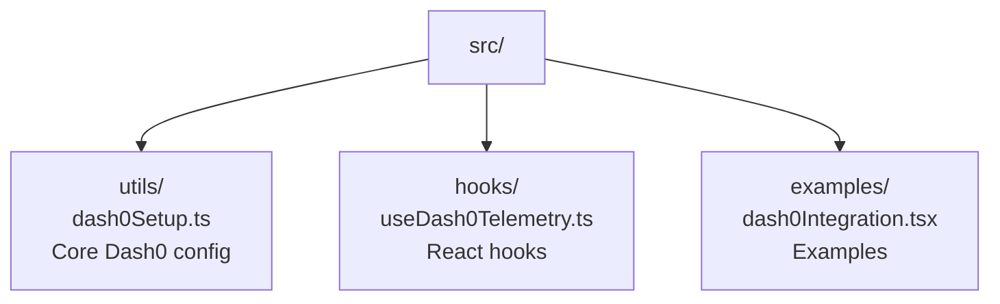

# Dash0 Integration Guide for Premium Weather App

## Overview

This guide explains how to integrate Dash0 observability into your Premium Weather App through VS
Code. Dash0 is an OpenTelemetry-native observability platform that provides logs, metrics, traces,
and dashboards for monitoring your application.

## 🚀 Quick Start

### 1. Sign Up for Dash0

1. Visit [https://dash0.com](https://dash0.com)
2. Sign up for a free account
3. Create your first organization
4. Get your authentication token from the dashboard

### 2. Configure Environment Variables

1. Copy the example environment file:

   ```bash
   cp .env.dash0.example .env.local
   ```

2. Update `.env.local` with your Dash0 credentials:

   ```env
   VITE_DASH0_AUTH_TOKEN=your-actual-auth-token-here
   VITE_DASH0_ENDPOINT=https://ingress.dash0.com/v1/traces
   VITE_DASH0_ENVIRONMENT=development
   ```

### 3. Install OpenTelemetry Dependencies (Optional)

For full telemetry features, install OpenTelemetry packages:

```bash
npm install @opentelemetry/api @opentelemetry/sdk-web @opentelemetry/exporter-otlp-http @opentelemetry/resources @opentelemetry/semantic-conventions
```

After installation, uncomment the OpenTelemetry code in `src/utils/dash0Setup.ts`.

## 📁 File Structure

The Dash0 integration includes these files:



## 🛠️ Integration Options

### Option 1: Use React Hooks (Recommended)

The easiest way to integrate Dash0 into your components:

```tsx
import { useWeatherTelemetry } from './hooks/useDash0Telemetry';

function WeatherComponent() {
  const telemetry = useWeatherTelemetry();

  const handleSearch = async (city: string) => {
    try {
      // Track weather API calls with automatic timing and error handling
      const weatherData = await telemetry.trackApiCall('weather', city, async () => {
        const response = await fetch(`/api/weather?city=${city}`);
        return response.json();
      });

      return weatherData;
    } catch (error) {
      // Errors are automatically tracked by trackApiCall
      throw error;
    }
  };

  return <div>Your weather component</div>;
}
```

### Option 2: Direct Telemetry Class

Use the telemetry class directly for more control:

```tsx
import { dash0Telemetry } from './utils/dash0Setup';

// Track user interactions
dash0Telemetry.trackUserInteraction('button_clicked', { button: 'search' });

// Track performance metrics
dash0Telemetry.trackPerformance('api_response_time', 250, 'ms');

// Track errors
dash0Telemetry.trackError(new Error('API failed'), 'Weather API');

// Track complex operations
await dash0Telemetry.trackOperation(
  'weather_data_processing',
  async () => {
    // Your operation here
    return processWeatherData();
  },
  { city: 'New York' }
);
```

## 📊 What Gets Tracked

### Automatic Tracking

- Component mount/unmount times
- API call response times
- Error occurrences and stack traces
- User interactions (clicks, navigation)
- Performance metrics

### Weather App Specific Tracking

- Weather API calls (geocoding, weather data)
- Search operations
- Geolocation requests
- Theme changes
- Location searches

### Custom Events

- Page views / screen changes
- Complex operation timing
- Business logic metrics
- User behavior analytics

## 🔧 Configuration

### Environment Variables

| Variable                     | Description                     | Default                               |
| ---------------------------- | ------------------------------- | ------------------------------------- |
| `VITE_DASH0_AUTH_TOKEN`      | Your Dash0 authentication token | Required                              |
| `VITE_DASH0_ENDPOINT`        | Dash0 ingestion endpoint        | `https://ingress.dash0.com/v1/traces` |
| `VITE_DASH0_ENVIRONMENT`     | Environment name                | `development`                         |
| `VITE_DASH0_SERVICE_NAME`    | Service name in Dash0           | `weather                              |
| `VITE_DASH0_SERVICE_VERSION` | Service version                 | `1.0.0`                               |
| `VITE_DASH0_ENABLED`         | Enable/disable telemetry        | `true`                                |
| `VITE_DASH0_DEBUG`           | Enable debug logging            | `false`                               |

### Programmatic Configuration

```tsx
import { WeatherAppTelemetry } from './utils/dash0Setup';

const customTelemetry = new WeatherAppTelemetry({
  endpoint: 'https://your-custom-endpoint.com',
  authToken: 'your-token',
  serviceName: 'custom-weather-app',
  environment: 'production',
});

await customTelemetry.initialize();
```

## 🎯 VS Code Extensions

Install these VS Code extensions to enhance your observability workflow:

1. **Sprkl** (`sprkldev.sprkl-vscode`)
   - Personal Observability Platform powered by OpenTelemetry
   - Real-time code insights

2. **OpenTelemetry Validator** (`nimbushq.otel-validator`)
   - OTEL configuration validation
   - Autocomplete for OpenTelemetry configs

3. **New Relic CodeStream** (`codestream.codestream`)
   - Bring production telemetry into your IDE
   - Performance insights in context

## 📈 Dash0 Dashboard

Once telemetry is flowing, you can:

1. **View Traces**: See detailed request flows and timing
2. **Monitor Metrics**: Track performance and business metrics
3. **Analyze Logs**: Search and filter application logs
4. **Set Alerts**: Get notified of issues or anomalies
5. **Create Dashboards**: Build custom views of your data

### Key Metrics to Monitor

- **API Response Times**: Weather and geocoding API performance
- **Error Rates**: Failed requests and error frequency
- **User Interactions**: Feature usage and navigation patterns
- **Performance**: Component render times and load performance
- **Business Metrics**: Search success rates, popular locations

## 🐛 Debugging

### Check Telemetry Status

```tsx
import { dash0Telemetry } from './utils/dash0Setup';

// Check if telemetry is ready
console.log('Telemetry ready:', dash0Telemetry.isReady());

// Get current configuration
console.log('Config:', dash0Telemetry.getConfig());
```

### Enable Debug Mode

Set `VITE_DASH0_DEBUG=true` in your environment to see detailed telemetry logs in the browser
console.

### Common Issues

1. **No data in Dash0**: Check auth token and endpoint configuration
2. **Console errors**: Ensure OpenTelemetry packages are installed if using full features
3. **Performance impact**: Telemetry is designed to be lightweight, but you can disable in
   production if needed

## 🔒 Security Considerations

- Store auth tokens in environment variables, never in code
- Use different tokens for different environments
- Monitor telemetry data for sensitive information
- Consider data retention policies in Dash0

## 📝 Best Practices

1. **Meaningful Names**: Use descriptive operation and metric names
2. **Consistent Attributes**: Use standard attributes across similar operations
3. **Error Context**: Always provide context when tracking errors
4. **Performance Balance**: Don't over-instrument - focus on key user journeys
5. **Environment Separation**: Use different configurations for dev/staging/prod

## 🚀 Next Steps

1. Set up your Dash0 account and get your auth token
2. Configure environment variables
3. Start with basic hooks integration
4. Install OpenTelemetry packages for full features
5. Create custom dashboards in Dash0
6. Set up alerts for critical metrics

## 📚 Resources

- [Dash0 Documentation](https://www.dash0.com/documentation)
- [OpenTelemetry JavaScript](https://opentelemetry.io/docs/instrumentation/js/)
- [Dash0 API Reference](https://api-docs.dash0.com/)
- [Example Components](./src/examples/dash0Integration.tsx)

## 🤝 Support

For issues with this integration:

1. Check the browser console for errors
2. Verify environment configuration
3. Review the example components
4. Check Dash0 documentation for API issues

For Dash0 platform support:

- [Dash0 Support](https://www.dash0.com/contact)
- [Community Slack](https://dash0.com/slack) (if available)
- [GitHub Issues](https://github.com/dash0hq) (if applicable)
