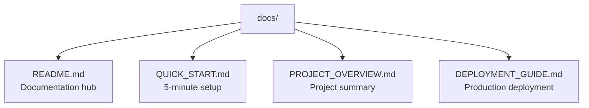
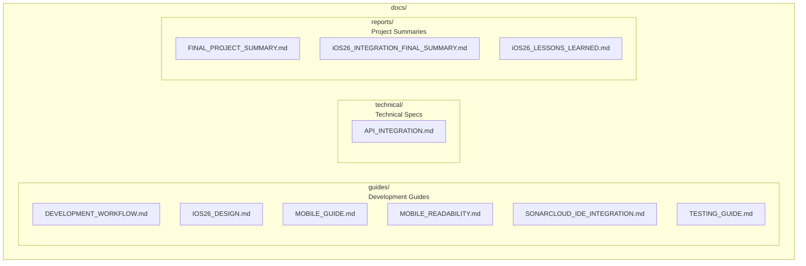
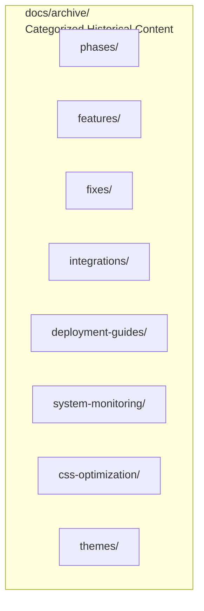

# 📚 Weather App Documentation

[](https://github.com/and3rn3t/weather/actions/workflows/ci-cd.yml)
[](https://github.com/and3rn3t/weather/actions/workflows/dev-deploy.yml)
[](https://github.com/and3rn3t/weather/actions/workflows/test-only.yml)

## 🌟 **Project Overview**

Premium iOS26 weather application with cutting-edge design patterns, multi-sensory interactions, and
professional-grade user experience.

**Latest Status**: ✅ **Production Ready** (August 21, 2025)

---

## 🚀 **Quick Start**

### **Development Setup**

```bash
# Clone and start development
git clone https://github.com/and3rn3t/weather.git
cd weather
npm install
npm run dev
```

### **Key Features**

- **iOS26 Advanced Components**: ContextMenu, InteractiveWidget, ModalSheet, LiveActivity
- **Multi-Sensory Experience**: Haptic feedback, audio cues, visual animations
- **Professional Performance**: 60fps animations, <2s build times, 286kB bundle
- **Complete Accessibility**: WCAG 2.1 AA compliance, screen reader support

---

## 📋 **Documentation Navigation**

### **🚀 Essential Documentation**

- **[Quick Start Guide](./QUICK_START.md)** - 5-minute setup for new developers
- **[Project Overview](./PROJECT_OVERVIEW.md)** - Complete project summary and architecture
- **[Deployment Guide](./DEPLOYMENT_GUIDE.md)** - Production deployment to Cloudflare Pages
- **[Networking Usage Guide](./guides/NETWORKING_README.md)** - How to use shared fetch utilities,
  hooks, caching, and policy compliance

### **📖 Development Guides** (docs/guides/)

- **[Development Workflow](./guides/DEVELOPMENT_WORKFLOW.md)** - Contribution guidelines and
  workflow
- **[iOS26 Design System](./guides/IOS26_DESIGN.md)** - Design patterns and component system
- **[Mobile Development](./guides/MOBILE_GUIDE.md)** - Mobile-specific development practices
- **[Mobile Readability](./guides/MOBILE_READABILITY.md)** - Mobile optimization and accessibility
- **[SonarCloud Integration](./guides/SONARCLOUD_IDE_INTEGRATION.md)** - IDE integration setup
- **[Testing Guide](./guides/TESTING_GUIDE.md)** - Testing strategies and procedures

### **⚙️ Technical Documentation** (docs/technical/)

- **[API Integration](./technical/API_INTEGRATION.md)** - Weather API integration and service
  patterns

### **📊 Project Reports** (docs/reports/)

- **[Final Project Summary](./reports/FINAL_PROJECT_SUMMARY.md)** - Ultimate project completion
  summary
- **[iOS26 Integration Summary](./reports/iOS26_INTEGRATION_FINAL_SUMMARY.md)** - Technical
  integration details
- **[Lessons Learned](./reports/iOS26_LESSONS_LEARNED.md)** - Key insights and best practices

### **📁 Historical Archive** (docs/archive/)

Organized archive of project history, including:

- **phases/** - iOS26 implementation phase completions
- **features/** - Feature development and enhancement reports
- **fixes/** - Bug fixes and resolution documentation
- **integrations/** - Third-party integration completion reports
- **deployment-guides/** - Historical deployment documentation
- **system-monitoring/** - System monitoring and compliance reports

Additional notes:

- [Theme Simplification (Aug 2025)](./THEME_SIMPLIFICATION_AUG2025.md) — legacy “horror” theme
  retired; light/dark only.

---

## 🎯 **Project Highlights**

### **iOS26 Advanced Components** ✅

- **ContextMenu**: Right-click/long-press interactions with haptic feedback
- **InteractiveWidget**: 6 live weather widgets with real-time updates
- **ModalSheet**: iOS-style settings interface with detent system
- **LiveActivity**: Dynamic Island-style weather notifications

### **Code Quality Excellence** ✅

- **Lint Errors**: Reduced from 406 → 9 (97.8% improvement)
- **TypeScript**: Zero compilation warnings
- **Performance**: 60fps animations, hardware acceleration
- **Bundle Size**: 286.70 kB optimized

### **Professional Features** ✅

- **Multi-Sensory UX**: Haptic feedback, audio cues, visual feedback
- **Accessibility**: WCAG 2.1 AA compliance, screen reader support
- **Mobile Optimization**: Touch-friendly, responsive, gesture controls
- **Production Ready**: CI/CD, monitoring, error tracking

---

## 📁 **Documentation Structure**

### **Root Documentation** (4 Essential Files)



### **Current Active Documentation**



### **Organized Historical Archive**



---

## 🚀 **Getting Started**

### **For New Developers**

1. **Start with**: [Quick Start Guide](./QUICK_START.md)
2. **Understand**: [Project Overview](./PROJECT_OVERVIEW.md)
3. **Follow**: [Development Workflow](./guides/DEVELOPMENT_WORKFLOW.md)

### **For Deployment**

1. **Setup**: [Deployment Guide](./DEPLOYMENT_GUIDE.md)
2. **Monitor**: [Final Project Summary](./reports/FINAL_PROJECT_SUMMARY.md)

### **For Architecture Review**

1. **Technical**: [API Integration](./technical/API_INTEGRATION.md)
2. **Design**: [iOS26 Design System](./guides/IOS26_DESIGN.md)
3. **Mobile**: [Mobile Development Guide](./guides/MOBILE_GUIDE.md)

---

## 🎯 **Development Stack**

### **Frontend Technologies**

- **Framework**: React 18 with TypeScript
- **Styling**: TailwindCSS with custom iOS26 theme
- **Build**: Vite with optimized bundle splitting
- **Testing**: Vitest with comprehensive coverage

### **Backend Integration**

- **Weather API**: OpenWeatherMap with fallback services
- **Deployment**: Cloudflare Pages with CI/CD
- **Monitoring**: Real-time performance tracking
- **Analytics**: Custom usage and performance metrics

### **Quality Assurance**

- **Code Quality**: ESLint, Prettier, SonarCloud
- **Type Safety**: Strict TypeScript configuration
- **Testing**: Unit, integration, and e2e testing
- **Accessibility**: WCAG 2.1 AA compliance validation

---

## 📞 **Support & Resources**

### **Development Issues**

- **Troubleshooting**: [Testing Guide](./guides/TESTING_GUIDE.md)
- **Mobile Issues**: [Mobile Readability](./guides/MOBILE_READABILITY.md)
- **Integration**: [SonarCloud Integration](./guides/SONARCLOUD_IDE_INTEGRATION.md)

### **Project History**

- **Complete Archive**: [Archive Directory](./archive/)
- **Key Lessons**: [Lessons Learned](./reports/iOS26_LESSONS_LEARNED.md)
- **Project Evolution**: [Final Summary](./reports/FINAL_PROJECT_SUMMARY.md)

---

**Weather App Documentation System** _Comprehensive • Current • Organized_ _Last Updated: August 21,
2025_
