# Cloudflare Pages Deployment Guide 🚀

## 🎯 **Overview**

This guide covers the complete CI/CD pipeline setup for deploying the Premium Weather App to Cloudflare Pages with automated testing, building, and deployment.

## 🏗️ **Architecture**

### **CI/CD Pipeline**

```mermaid
graph LR
    A[GitHub Push] --> B[🧪 Test & Lint]
    B --> C[🏗️ Build App]
    C --> D[🚀 Deploy to Cloudflare]
    
    E[Pull Request] --> F[🔍 Preview Deploy]
```



### **Deployment Strategy**

- **Main Branch** → Production deployment
- **Pull Requests** → Preview deployments
- **Feature Branches** → Test-only (no deployment)

## 🔧 **Setup Instructions**

### **1. Cloudflare Pages Setup**

1. **Create Cloudflare Account**
   - Visit [Cloudflare Dashboard](https://dash.cloudflare.com)
   - Sign up or log in to your account

2. **Get API Credentials**

   ```bash
   # Navigate to: My Profile > API Tokens
   # Create Custom Token with permissions:
   # - Zone:Zone:Read
   # - Zone:Page Rules:Edit  
   # - Account:Cloudflare Pages:Edit
   ```

3. **Find Account ID**

   ```bash
   # Right sidebar in Cloudflare Dashboard
   # Under "API" section, copy Account ID
   ```

### **2. GitHub Secrets Configuration**

Add these secrets to your GitHub repository:

- `Settings` → `Secrets and variables` → `Actions` → `New repository secret`

```bash
CLOUDFLARE_API_TOKEN=your_api_token_here
CLOUDFLARE_ACCOUNT_ID=your_account_id_here
```

### **3. Project Setup**

```bash
# Clone and setup
git clone https://github.com/yourusername/weather.git
cd weather

# Install dependencies
npm install

# Test build locally
npm run build
npm run preview
```

## 📦 **Build Configuration**

### **Vite Production Settings**

- **Output Directory**: `dist/`
- **Source Maps**: Enabled for debugging
- **Code Splitting**: Vendor and utils chunks
- **Minification**: ESBuild for optimal performance
- **Target**: ES2020 for modern browser support

### **Environment Variables**

```bash
# Production Environment
VITE_APP_NAME=Premium Weather App
VITE_APP_VERSION=1.0.0
VITE_APP_ENVIRONMENT=production
VITE_WEATHER_API_URL=https://api.open-meteo.com/v1/forecast
VITE_GEOCODING_API_URL=https://nominatim.openstreetmap.org/search
```

### **Performance Optimizations**

- **Chunk Splitting**: Vendor libraries separated from app code
- **Tree Shaking**: Unused code eliminated
- **Asset Optimization**: Images and fonts optimized
- **Gzip Compression**: Enabled via Cloudflare

## 🔄 **Deployment Process**

### **Automatic Deployment**

1. **Push to Main** → Production deployment
2. **Open Pull Request** → Preview deployment
3. **Merge PR** → Updated production deployment

### **Manual Deployment**

```bash
# Build locally
npm run build

# Deploy using Wrangler CLI (optional)
npx wrangler pages publish dist --project-name premium-weather-app
```

## 🧪 **CI/CD Pipeline Details**

### **Test Stage** 🧪

- **ESLint**: Code quality and style checks
- **Vitest**: Unit and integration tests
- **Coverage**: Minimum 70% coverage requirement
- **TypeScript**: Type checking and compilation

### **Build Stage** 🏗️

- **Dependencies**: npm ci for clean install
- **Build**: Production-optimized bundle
- **Artifacts**: Upload build files for deployment
- **Validation**: Ensure build completes successfully

### **Deploy Stage** 🚀

- **Production**: Deploys on main branch push
- **Preview**: Deploys on pull request
- **Rollback**: Automatic rollback on deployment failure
- **Cache**: Intelligent caching for faster builds

## 🌐 **Cloudflare Pages Features**

### **Performance Features**

- **Global CDN**: Sub-100ms response times worldwide
- **HTTP/3**: Latest protocol for optimal performance
- **Image Optimization**: Automatic image resizing and format conversion
- **Brotli Compression**: Better compression than Gzip

### **Security Features**

- **SSL/TLS**: Automatic HTTPS with free certificates
- **DDoS Protection**: Built-in protection against attacks
- **WAF**: Web Application Firewall for security
- **Access Control**: IP allowlists and geographic restrictions

### **Developer Features**

- **Preview Deployments**: Every PR gets a preview URL
- **Rollback**: One-click rollback to previous versions
- **Analytics**: Built-in web analytics and performance metrics
- **Functions**: Serverless functions at the edge (future use)

## 📊 **Monitoring & Analytics**

### **Build Monitoring**

- **GitHub Actions**: Build status and logs
- **Cloudflare Dashboard**: Deployment history and metrics
- **Error Tracking**: Automatic error reporting and alerts

### **Performance Monitoring**

- **Core Web Vitals**: LCP, FID, CLS tracking
- **Real User Monitoring**: Actual user performance data
- **Synthetic Testing**: Automated performance testing
- **Uptime Monitoring**: 99.9% uptime SLA

## 🚨 **Troubleshooting**

### **Common Issues**

1. **Build Failures**

   ```bash
   # Check Node.js version
   node --version  # Should be 22.x

   # Clear cache and reinstall
   rm -rf node_modules package-lock.json
   npm install
   ```

2. **API Token Issues**

   ```bash
   # Verify token permissions in Cloudflare Dashboard
   # Ensure Account ID is correct
   # Check token expiration date
   ```

3. **Deployment Failures**

   ```bash
   # Check GitHub Actions logs
   # Verify Cloudflare project name matches
   # Ensure dist/ directory exists after build
   ```

### **Debug Commands**

```bash
# Local build testing
npm run build
npm run preview

# Check build output
ls -la dist/

# Test production environment
npm run build && npx serve dist
```

## 🔮 **Future Enhancements**

### **Phase E: Enhanced Deployment**

- **Multi-Environment**: Staging and production environments
- **Feature Flags**: Runtime feature toggling
- **A/B Testing**: Split testing for new features
- **Progressive Deployment**: Canary releases

### **Advanced Features**

- **Edge Functions**: API endpoints at the edge
- **Database Integration**: Cloudflare D1 for data storage
- **Authentication**: Cloudflare Access integration
- **Real-time Features**: WebSocket support

## 📚 **Resources**

### **Documentation**

- [Cloudflare Pages Docs](https://developers.cloudflare.com/pages/)
- [GitHub Actions Guide](https://docs.github.com/en/actions)
- [Vite Build Guide](https://vitejs.dev/guide/build.html)

### **Tools**

- [Cloudflare Dashboard](https://dash.cloudflare.com)
- [GitHub Actions](https://github.com/features/actions)
- [Vite](https://vitejs.dev/)

## ✅ **Deployment Checklist**

- [ ] Cloudflare account created
- [ ] API token generated with correct permissions
- [ ] GitHub secrets configured
- [ ] Local build test successful
- [ ] Environment variables configured
- [ ] CI/CD pipeline tested
- [ ] Production deployment verified
- [ ] Performance metrics baseline established

## Ready to deploy! 🚀
