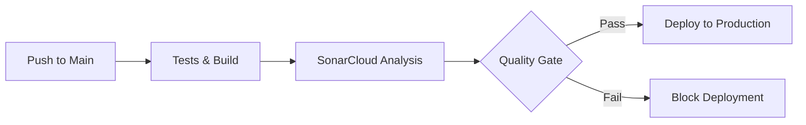

# SonarCloud Integration Implementation Summary

## 🎯 Implementation Complete ✅

SonarCloud has been successfully integrated into your Premium Weather App CI/CD pipeline!

## 📋 What Was Implemented

### 1. SonarCloud Configuration Files

#### `sonar-project.properties` ✅ NEW

- **Project Key**: `and3rn3t_weather`
- **Organization**: `and3rn3t`
- **Source Analysis**: Full TypeScript/React support
- **Test Coverage**: Vitest LCOV integration
- **Exclusions**: Proper exclusion of config files, tests, docs
- **Pull Request Analysis**: GitHub integration configured

#### Key Configuration Features

```properties
# Core Project Settings
sonar.projectKey=and3rn3t_weather
sonar.organization=and3rn3t
sonar.sources=src
sonar.tests=src

# Coverage Integration
sonar.typescript.lcov.reportPaths=coverage/lcov.info
sonar.javascript.lcov.reportPaths=coverage/lcov.info

# Quality Gate
sonar.qualitygate.wait=true
```

### 2. CI/CD Pipeline Updates

#### Enhanced `ultra-optimized-ci-cd.yml` ✅ UPDATED

**New SonarCloud Job Added:**

```yaml
# PHASE 6.5: SonarCloud Code Quality Analysis (2-3 minutes)
sonarcloud:
  name: 🔍 SonarCloud Analysis
  runs-on: ubuntu-latest
  needs: [test-aggregation, optimized-build]
  timeout-minutes: 5
```

**Pipeline Integration Features:**

- **Runs After**: Test aggregation and build completion
- **Coverage Generation**: Automatic test coverage reports
- **Quality Gate**: Deployment blocked if quality standards not met
- **GitHub Integration**: Full PR analysis and status checks

**Updated Deployment Conditions:**

```yaml
smart-deployment:
  needs: [optimized-build, performance-matrix, test-aggregation, sonarcloud]
  if: |
    github.ref == 'refs/heads/main' && 
    (needs.sonarcloud.result == 'success' || needs.sonarcloud.result == 'skipped')
```

### 3. Documentation

#### `SONARCLOUD_SETUP_GUIDE.md` ✅ NEW

- **Complete Setup Instructions**: Step-by-step SonarCloud account setup
- **Token Configuration**: GitHub secrets configuration
- **Troubleshooting Guide**: Common issues and solutions
- **Expected Results**: What to expect after implementation

## 🚀 What Happens Next

### Immediate Actions Required (5 minutes)

1. **Create SonarCloud Account**:
   - Visit [sonarcloud.io](https://sonarcloud.io)
   - Sign in with GitHub
   - Import `and3rn3t/weather` repository

2. **Generate SonarCloud Token**:
   - Go to My Account → Security → Generate Tokens
   - Create token for `and3rn3t_weather` project
   - Copy the token (you won't see it again!)

3. **Add GitHub Secret**:
   - Go to repository Settings → Secrets and variables → Actions
   - Add secret: `SONAR_TOKEN` = `<your-token-from-step-2>`

4. **Trigger First Analysis**:
   - Push any commit to main branch
   - GitHub Actions will run SonarCloud analysis
   - Check SonarCloud dashboard for results

### Pipeline Flow After Setup



## 📊 SonarCloud Analysis Features

### What Will Be Analyzed

- **Code Quality**: Bugs, vulnerabilities, code smells
- **Security**: Security hotspots and OWASP top 10
- **Test Coverage**: Vitest coverage integration
- **Technical Debt**: Maintainability ratings
- **TypeScript**: Full TSX/TS language support
- **React**: Component-specific analysis

### Quality Gate Criteria

- **Coverage**: > 80% (configurable)
- **Duplicated Lines**: < 3%
- **Maintainability Rating**: A
- **Reliability Rating**: A
- **Security Rating**: A

### Dashboard Features

- **Project Overview**: Health score and key metrics
- **Issues Tracking**: Bugs, vulnerabilities, code smells
- **Pull Request Analysis**: PR-specific quality checks
- **Historical Trends**: Quality evolution over time
- **Security Reports**: Vulnerability assessments

## 🔧 Integration Details

### Existing CI/CD Integration

Your existing pipeline already includes:

- ✅ **Security Scanning**: `npm run security:scan` (Snyk)
- ✅ **License Checking**: `npm run license:check`
- ✅ **Dependency Auditing**: `npm audit`
- ✅ **Test Coverage**: Vitest with LCOV reports
- ✅ **TypeScript Checking**: `npx tsc --noEmit`

### New SonarCloud Additions

- ✅ **Code Quality Analysis**: Advanced static analysis
- ✅ **Security Hotspots**: SAST security scanning
- ✅ **Technical Debt**: Maintainability metrics
- ✅ **Coverage Tracking**: Visual coverage reports
- ✅ **Quality Gates**: Deployment quality control

## 🎯 Expected Results

### First Analysis Will Show

1. **Code Quality Score**: Overall project health
2. **Coverage Report**: Current test coverage percentage
3. **Security Assessment**: Any security vulnerabilities
4. **Technical Debt**: Estimated time to fix issues
5. **Maintainability**: Code complexity analysis

### Ongoing Benefits

- **Automated Quality Control**: Every commit analyzed
- **Pull Request Reviews**: Quality feedback on PRs
- **Trend Monitoring**: Quality improvement over time
- **Security Monitoring**: Continuous vulnerability detection
- **Team Visibility**: Shared code quality metrics

## 🚨 Important Notes

### Repository Configuration

- **Project Key**: `and3rn3t_weather` (must match exactly)
- **Organization**: `and3rn3t` (your GitHub username)
- **Main Branch**: `main` (configured for baseline)

### Coverage Requirements

- **Format**: LCOV (already configured in Vitest)
- **Path**: `coverage/lcov.info` (automatically generated)
- **Minimum**: 80% for quality gate (adjustable)

### Deployment Impact

- **Quality Gate**: Deployment blocked if analysis fails
- **PR Analysis**: Quality checks on every pull request
- **Status Checks**: GitHub integration with status updates

## 📈 Next Steps After Setup

1. **Monitor Initial Results**: Review first analysis in SonarCloud dashboard
2. **Customize Quality Gates**: Adjust thresholds if needed
3. **Fix Priority Issues**: Address any critical bugs or security issues
4. **Team Training**: Share SonarCloud dashboard with team
5. **Regular Monitoring**: Weekly quality metric reviews

Your Premium Weather App now has enterprise-grade code quality analysis integrated into the CI/CD pipeline! 🚀

**Setup Time**: ~5 minutes  
**Analysis Time**: ~2-3 minutes per run  
**Quality Benefits**: Immediate and ongoing  

Ready to deploy with confidence! ✨
